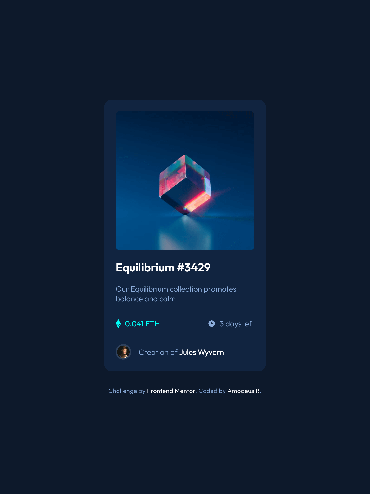
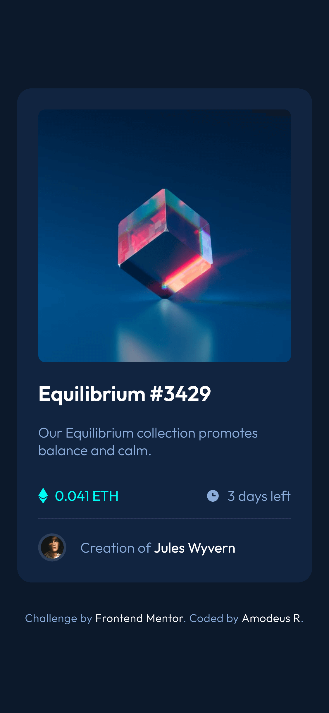

<!-- markdownlint-disable MD033 -->
<h1 align="center">Frontend Mentor - NFT preview card component</h1>

<!--  -->

This is a solution to the <a href="">NFT preview card component</a> challenge on Frontend Mentor.

<h3 align="center">Languages</h3>

  <a href="#">English</a> • <a href="./lang/README.pt-br.md">Português</a>

<!-- markdownlint-enable MD033 -->

## Table of contents

- [Overview](#overview)
  - [The challenge](#the-challenge)
  - [Screenshots](#screenshots)
  - [Links](#links)
- [My process](#my-process)
  - [Built with](#built-with)
  - [What I learned](#what-i-learned)
  - [Useful resources](#useful-resources)
- [Author](#author)

## Overview

### The challenge

- View the optimal layout depending on their device's screen size
- See hover states for interactive elements

### Screenshots

| Desktop View (1280px) | Tablet View (768px) | Mobile View (375px)|
|-------|-------|-------|
||||

### Links

- Live Site URL: [Cloudfare](https://fm--nft-preview-card.pages.dev/)

## My process

### Built with

- Flexbox
- Sass
  - Functions
  - Mixins
  - Modules
  - Variables
- Parcel Bundler

### What I learned

With this simple project, I've learned plenty of possibilities with Sass! It has shown itself more and more not only as an useful but splendid tool for writing CSS in a much quicker, better and practical way :D

### Useful resources

- [Image in flex container stretching](https://techstacker.com/how-to-prevent-image-stretching-with-flexbox/) - I was having problems with the image stretching since it was a flex item, but this helped me solve this problem. A simple solution, for a simple issue :)

- [Opacity in color variables with Sass](https://stackoverflow.com/questions/21189495/setting-opacity-on-primary-color-in-sass) - At some point, I realized I would need to use transparency on the colors to use it as intended, so I was curious to know if Sass had a simple and quick solution for this, and guess what? It has!

- [img container being slightly larger than img itself](https://stackoverflow.com/questions/11126685/why-does-container-div-insist-on-being-slightly-larger-than-img-or-svg-content) - Surely this issue can be a big hassle for anyone, specially those unwary of HTML's legacy features, So it's great to be aware about these legacy behaviors.

## Author

- Github - [@AmodeusR](https://github.com/amodeusr)
- Linkedin - [@AmodeusR](https://www.linkedin.com/in/AmodeusR)
- Frontend Mentor - [@AmodeusR](https://www.frontendmentor.io/profile/AmodeusR)
