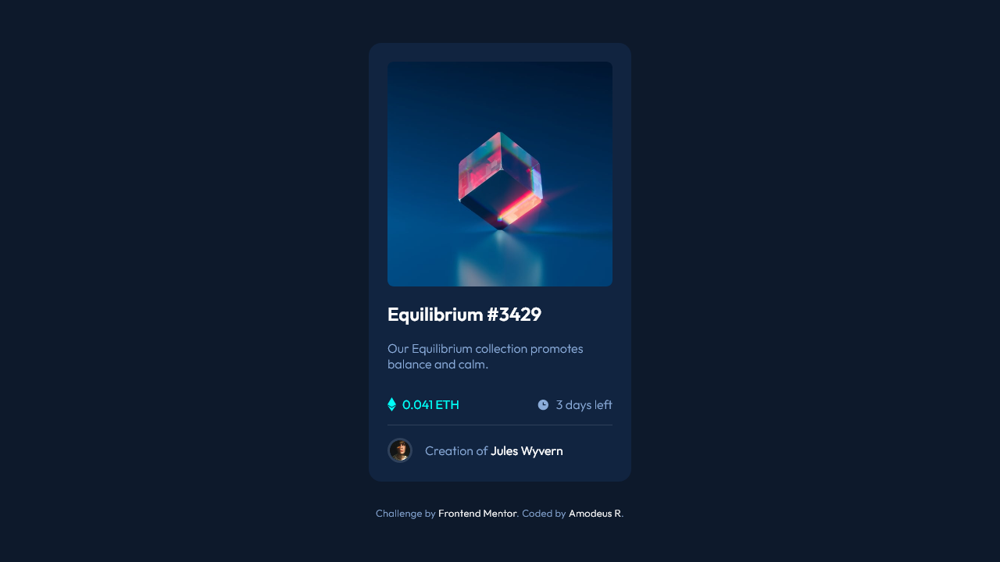
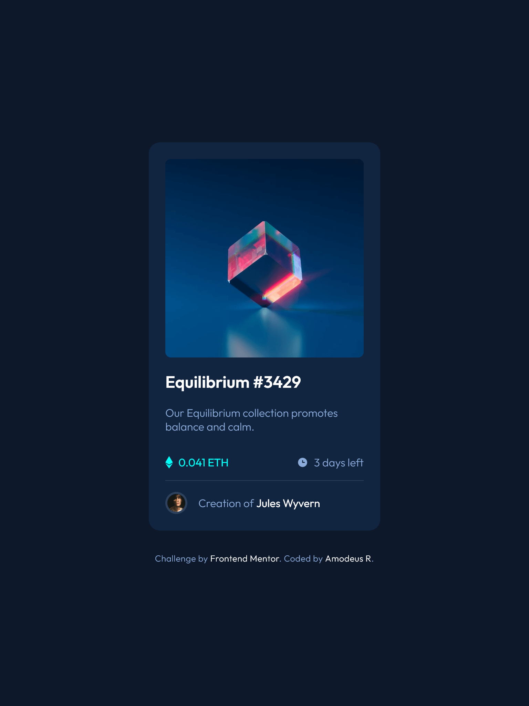
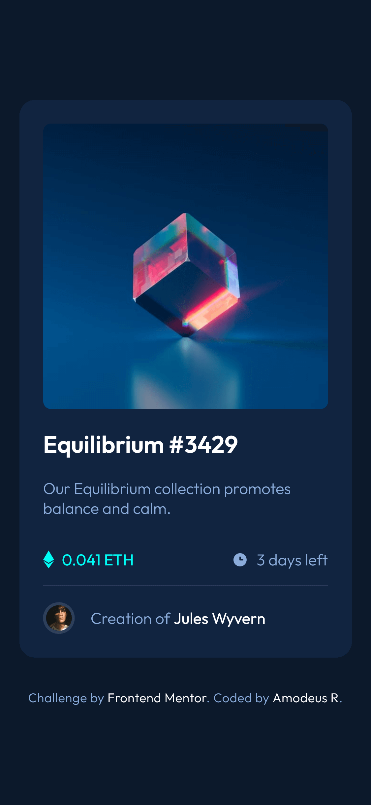

<!-- markdownlint-disable MD033 -->
<h1 align="center">Frontend Mentor - NFT Preview Card Component</h1>

Esta é uma resolução ao desafio <a href="link">NFT Preview Card Component</a> por Frontend Mentor.

<h3 align="center">Idiomas</h3>

  <a href="../README.md">English</a> • <a href="#">Português</a>

<!-- markdownlint-enable MD033 -->

## Índice

- [Visão Geral](#visão-geral)
  - [O desafio](#o-desafio)
  - [Capturas de tela](#capturas-de-tela)
  - [Links](#links)
- [Meu processo](#meu-processo)
  - [Desenvolvido com...](#desenvolvido-com)
  - [O que aprendi](#o-que-aprendi)
  - [Recursos úteis](#recursos-úteis)
- [Autor](#autor)

## Visão geral

### O desafio

- Listar desafios

### Capturas de tela

| Tela Desktop (1280px) | Tela Tablet (768px) | Tela Celular (375px) |
|-------|-------|-------|
||||

### Links

- URL para o Site: [Cloudfare](https://fm--nft-preview-card.pages.dev/)

## Meu processo

### Desenvolvido com...

- Flexbox
- Sass
  - Funções
  - Mixins
  - Módulos
  - Variáveis
- Parcel Bundler

### O que aprendi

  Com este projeto simples, eu aprendi várias possibilidades com Sass! Sass tem se demonstrado cada vez mais e mais não somente como uma tecnologia útil mas esplêndida para escrever CSS de uma forma muito mais rápida, melhor e prática :D

### Recursos úteis

- [Imagem em container flex esticando](https://techstacker.com/how-to-prevent-image-stretching-with-flexbox/) - Eu estava tendo problemas com a imagem se esticando por ser um flex item, mas isso me ajudou a resolver o problema. Uma solução simples, para um problema simples :)

- [Opacidade em variáveis de cor com Sass](https://stackoverflow.com/questions/21189495/setting-opacity-on-primary-color-in-sass) - Em algum momento, eu percebi que eu precisaria usar transparência nas cores para usá-las como pretendido, então tive a curiosidade de saber se Sass possuía uma forma rápida e fácil de resolver isso, e adivinha? Tem!

- [Container img sendo levemente maior que a própria imagem](https://stackoverflow.com/questions/11126685/why-does-container-div-insist-on-being-slightly-larger-than-img-or-svg-content) - Certamente este pode ser uma grande dor de cabeça para qualquer um, especialmente para aqueles desavisados das características legado do HTML, então é ótimo estar ciente desses comportamentos legado.

## Autor

- Github - [@AmodeusR](https://github.com/amodeusr)
- Linkedin - [@AmodeusR](https://www.linkedin.com/in/AmodeusR)
- Frontend Mentor - [@AmodeusR](https://www.frontendmentor.io/profile/AmodeusR)
